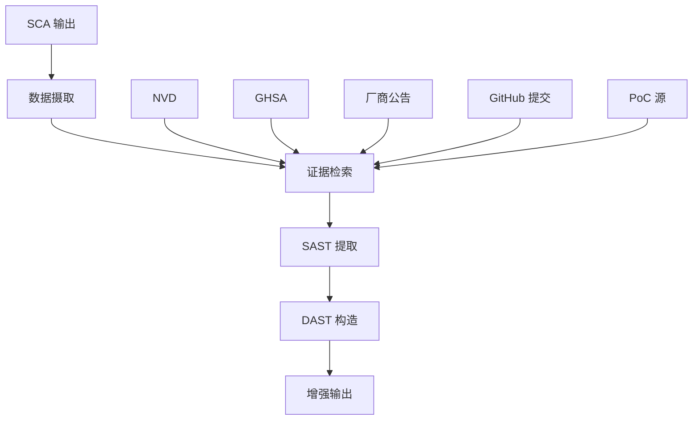

# SCA-enhancer

基于 LangGraph 和大语言模型的智能 SCA 工具增强器

## 项目概述

SCA-enhancer 是一个智能代理，通过以下方式增强软件成分分析（SCA）工具的能力：

- **增强分析**：处理 SCA 工具输出并用额外的漏洞情报丰富它们
- **证据检索**：从权威来源（NVD、GHSA、厂商公告等）收集全面证据
- **SAST 集成**：提取 SAST 汇点用于静态分析工具集成
- **DAST 构造**：生成 DAST 输入用于动态安全测试
- **AI 驱动**：利用大语言模型进行智能分析和模式识别

## 系统架构

基于 LangGraph 生态系统构建，包含以下核心组件：



### LangGraph 工作流

工作流使用 `SCAEnhancerState` 作为主状态，包含基本信息、处理数据和元数据。核心节点包括：

1. **ingest_node**: 摄取和解析 SCA 工具输出
2. **retrieve_evidence_node**: 检索相关安全证据
3. **extract_sast_node**: 提取 SAST 分析结果
4. **construct_dast_node**: 构造 DAST 测试用例
5. **export_results_node**: 导出最终结果

## 核心功能

### 支持的数据源
- **NVD (国家漏洞数据库)**
- **GitHub 安全公告 (GHSA)**
- **厂商安全公告**
- **GitHub 提交分析**
- **概念验证 (PoC) 源**

### 输出格式
- **enhanced_findings.json**：用证据丰富的原始发现
- **SAST_Sinks.json**：SAST 工具的函数调用和模式
- **DAST_Inputs.json**：DAST 工具的测试场景
- **processing_summary.json**：综合分析统计

## 安装

### 环境要求
- Python 3.8+
- OpenAI API 密钥或 Anthropic API 密钥

### 安装步骤
```bash
# 克隆项目
git clone https://github.com/your-org/SCA-enhancer.git
cd SCA-enhancer

# 创建虚拟环境
python -m venv venv
source venv/bin/activate  # macOS/Linux
# 或 venv\Scripts\activate  # Windows

# 安装依赖
pip install -r requirements.txt
pip install -e .
```

## 配置

### 环境变量配置
复制 `.env.example` 为 `.env` 并配置：

```bash
# LLM 提供商配置（选择其一）
SCA_ENHANCER_LLM_PROVIDER=openai
SCA_ENHANCER_LLM_MODEL=gpt-4
SCA_ENHANCER_LLM_API_KEY=your_openai_api_key

# 或使用 Anthropic
# SCA_ENHANCER_LLM_PROVIDER=anthropic
# SCA_ENHANCER_LLM_API_KEY=your_anthropic_api_key

# LangSmith 追踪（可选）
LANGCHAIN_TRACING_V2=true
LANGCHAIN_API_KEY=your_langsmith_api_key
LANGCHAIN_PROJECT=sca-enhancer

# 证据源配置
SCA_ENHANCER_NVD_ENABLED=true
SCA_ENHANCER_GHSA_ENABLED=true
SCA_ENHANCER_VENDOR_ADVISORIES_ENABLED=true
SCA_ENHANCER_GITHUB_COMMITS_ENABLED=true
SCA_ENHANCER_POC_SOURCES_ENABLED=true

# API 密钥（用于速率限制）
GITHUB_TOKEN=your_github_token
NVD_API_KEY=your_nvd_api_key

# 日志配置
SCA_ENHANCER_LOG_LEVEL=INFO
```

### JSON 配置文件
使用 JSON 配置文件自定义行为：

```json
{
  "llm": {
    "provider": "openai",
    "model": "gpt-4",
    "temperature": 0.1,
    "max_tokens": 4000
  },
  "retriever": {
    "top_k": 5,
    "similarity_threshold": 0.7
  },
  "output": {
    "format": "json",
    "include_evidence": true,
    "include_reasoning": true
  }
}
```

## 使用方法

### 命令行工具（推荐）

```bash
# 健康检查
python -m cli.agent.main health-check

# 处理 SCA 输出
python -m cli.agent.main process examples/sample_opensca_output.json \
  --tool opensca --output-dir output/

# 生成配置模板
python -m cli.agent.main config-template

# 查看版本信息
python -m cli.agent.main version
```

### Python API

```python
from sca_enhancer.agent import create_agent

# 创建代理
agent = create_agent()

# 处理 SCA 输出
results = await agent.process(
    input_path="opensca_output.json",
    output_dir="./output",
    sca_tool="opensca"
)
```

### 直接使用工作流

```python
from sca_enhancer.agent.graph import create_agent_graph, run_workflow

# 创建工作流图
graph = create_agent_graph()

# 运行工作流
final_state = await run_workflow(
    graph=graph,
    input_path="opensca_output.json",
    output_dir="./output",
    sca_tool="opensca"
)
```

## 项目结构

```
SCA-enhancer/
├── sca_enhancer/           # 主包
│   └── agent/              # 代理实现
│       ├── agent.py        # 主代理类和工作流入口
│       ├── config.py       # 配置管理
│       ├── graph.py        # LangGraph 工作流定义
│       ├── nodes.py        # 工作流节点函数
│       ├── state.py        # 状态管理结构
│       ├── schemas.py      # 数据模型定义
│       ├── ingest.py       # 数据摄取模块
│       ├── retriever.py    # 证据检索模块
│       ├── sast_extractor.py # SAST 提取模块
│       └── dast_constructor.py # DAST 构造模块
├── cli/                    # 命令行工具
│   └── agent/
│       └── main.py         # CLI 入口点
├── tests/                  # 测试套件
├── examples/               # 使用示例
│   ├── config_template.json    # 配置模板
│   ├── sample_opensca_output.json # 示例数据
│   └── output/             # 示例输出
├── requirements.txt        # 项目依赖（包含生产和开发环境）
└── README.md              # 本文件
```

## 测试

运行测试套件：

```bash
# 运行所有测试
pytest

# 运行覆盖率测试
pytest --cov=sca_enhancer

# 运行特定测试类别
pytest tests/unit/
pytest tests/integration/
```

## 输出示例

### 增强发现
```json
{
  "metadata": {
    "generated_at": "2024-01-15T10:30:00",
    "total_findings": 25,
    "total_evidence": 47,
    "generator": "SCA-enhancer"
  },
  "findings": [
    {
      "id": "finding_001",
      "component_name": "lodash",
      "component_version": "4.17.20",
      "vulnerability": {
        "title": "原型污染",
        "cve_id": "CVE-2021-23337",
        "severity": "high"
      },
      "evidence": [
        {
          "source": "nvd",
          "content": "详细漏洞分析...",
          "confidence": "high"
        }
      ]
    }
  ]
}
```

## LangSmith 监控

配置 LangSmith 后，可以在追踪界面观察：

- **LLM 调用**：每次 AI 调用的输入输出
- **执行时间**：各步骤的性能指标
- **数据流**：组件间的数据传递
- **决策过程**：AI 分析和推理过程

访问 [LangSmith Projects](https://smith.langchain.com/projects/) 查看详细追踪。

## 故障排除

### 常见问题

1. **API 密钥错误**：检查 `.env` 文件中的密钥是否正确
2. **网络连接**：确保能访问 OpenAI/LangSmith API
3. **依赖问题**：重新安装依赖 `pip install -r requirements.txt`

### 调试模式

```bash
# 启用详细日志
export SCA_ENHANCER_LOG_LEVEL=DEBUG
python -m cli.agent.main process examples/sample_opensca_output.json \
  --tool opensca --output-dir output/
```

## 开发指南

### 添加新节点

1. 在 `nodes.py` 中定义节点函数：
```python
def new_analysis_node(state: SCAEnhancerState) -> SCAEnhancerState:
    """新的分析节点"""
    # 实现节点逻辑
    return state
```

2. 在 `graph.py` 中添加节点到工作流：
```python
graph.add_node("new_analysis", new_analysis_node)
graph.add_edge("previous_node", "new_analysis")
```

### 自定义工作流

使用 LangGraph Studio 或直接编辑 `graph.py` 文件来修改工作流结构：

```python
from sca_enhancer.agent.graph import create_agent_graph

# 创建自定义工作流
def create_custom_workflow():
    graph = create_agent_graph()
    # 添加自定义节点和边
    return graph
```

### 性能优化

1. **缓存机制**：启用向量存储缓存
2. **并行处理**：使用异步节点处理
3. **内存管理**：及时清理大型数据结构
4. **批处理**：对多个发现进行批量处理

## 贡献

欢迎贡献！请查看我们的贡献指南了解详情。

### 开发设置
```bash
# 克隆仓库
git clone https://github.com/your-org/SCA-enhancer.git
cd SCA-enhancer

# 安装开发依赖
pip install -r requirements.txt
pip install -e .

# 运行测试
pytest
```

## 许可证

本项目采用 MIT 许可证 - 查看 [LICENSE](LICENSE) 文件了解详情。

## 致谢

- **LangGraph 团队** 提供优秀的基于图的 LLM 框架
- **LangChain 社区** 提供全面的 LLM 生态系统
- **安全研究社区** 提供漏洞情报来源
